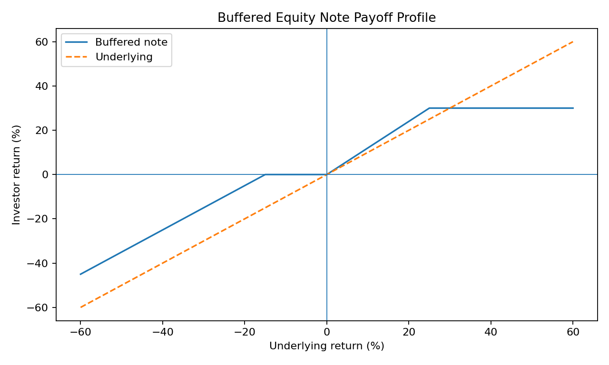
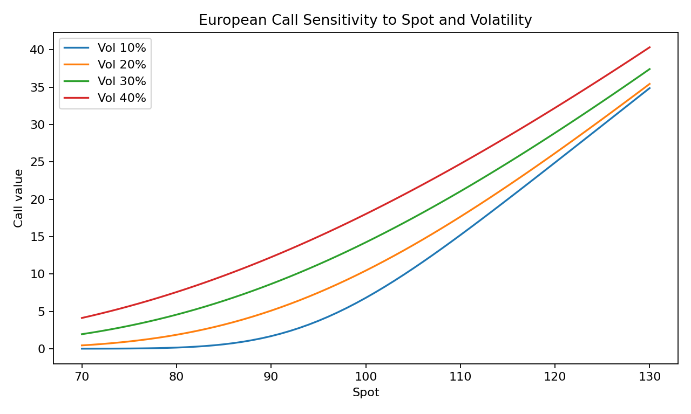

# QuantFin Structured Products Analytics Platform

A containerized quantitative-finance platform for **equity-derivatives pricing, volatility analysis, market risk, and structured-product analytics**.

> Research and portfolio implementation. Not approved for live trading, client valuation, investment advice, or real-money risk management.

## Core capabilities

- **European option pricing** with Black-Scholes
- **Greeks**: Delta, Gamma, Vega, Theta, Rho
- **Implied-volatility inversion** using bisection
- **Monte Carlo pricing** with standard-error reporting
- **American option pricing** with a recombining binomial tree
- **Historical VaR and CVaR**
- **Delta-Gamma-Vega scenario P&L approximation**
- **Buffered equity-note payoff analytics**
- **Path-dependent autocallable pricing** under constant-volatility GBM
- **FastAPI REST services** with Pydantic validation and OpenAPI documentation
- **Streamlit analytics interface**
- **Automated model-validation tests**, Docker Compose, and GitHub Actions CI

## Technology

Python 3.12, FastAPI, Pydantic, NumPy, SciPy, Pandas, Streamlit, Matplotlib, Pytest, Docker, Docker Compose, GitHub Actions.

## Repository structure

```text
QuantFin/
├── backend/
│   ├── app/
│   │   ├── api/                 # HTTP routes
│   │   ├── models/              # Request/response schemas
│   │   └── services/            # Pricing, risk, structured-product models
│   └── tests/                   # Model and API validation tests
├── dashboard/                   # Streamlit analytics interface
├── data/
│   └── validation/              # Deterministic model-validation dataset
├── reports/                     # Generated analytics and validation outputs
├── scripts/
│   ├── run_model_validation.py
│   └── generate_analytics_reports.py
├── .github/workflows/ci.yml     # Continuous integration
├── docker-compose.yml
├── MODEL_RISK.md
└── TECHNICAL_WALKTHROUGH.md
```

## Architecture

```text
Streamlit Analytics Interface
            |
            v
FastAPI Quantitative Services
     |          |          |
  Pricing     Risk     Structured Products
     |
NumPy / SciPy Quantitative Models
```

The UI and API run as separate services. Quantitative logic is isolated in service modules so pricing models can be tested independently from presentation and transport layers.

## Analytics reports

### Buffered equity-note payoff profile



### European option sensitivity



## Containerized deployment

Requirements: Docker Desktop or a compatible Docker runtime.

```bash
docker compose up --build
```

Open:

- Analytics interface: http://localhost:8501
- API documentation: http://localhost:8000/docs
- API health check: http://localhost:8000/health

Stop services with:

```bash
docker compose down
```

## Local development

Create one development environment from the repository root:

```bash
python -m venv .venv
source .venv/bin/activate
pip install -r requirements-dev.txt
```

### Start the API

```bash
make run-api
```

### Start the analytics interface

In another terminal:

```bash
source .venv/bin/activate
make run-dashboard
```

## Validation workflow

Run automated tests:

```bash
make test
```

Run the quantitative validation workflow:

```bash
make validate
```

This generates:

```text
reports/model_validation_summary.txt
```

Regenerate analytical figures:

```bash
make reports
```

## Validation dataset

`data/validation/market_returns_validation.csv` is a deterministic validation fixture used to exercise the historical VaR/CVaR workflow consistently across local, CI, and containerized environments.

It is **not represented as live or historical exchange data**. A production market-risk implementation would replace this fixture with governed market-data feeds, source metadata, quality controls, timestamps, lineage, and reconciliation.

## API usage

### Black-Scholes pricing and Greeks

```bash
curl -X POST http://localhost:8000/pricing/black-scholes \
  -H "Content-Type: application/json" \
  -d '{
    "spot": 100,
    "strike": 100,
    "rate": 0.05,
    "volatility": 0.20,
    "maturity": 1.0,
    "dividend_yield": 0.0,
    "option_type": "call"
  }'
```

For these assumptions, the Black-Scholes call value is approximately **10.4506**.

### Implied volatility

```bash
curl -X POST http://localhost:8000/volatility/implied \
  -H "Content-Type: application/json" \
  -d '{
    "market_price": 10.4506,
    "spot": 100,
    "strike": 100,
    "rate": 0.05,
    "maturity": 1.0,
    "dividend_yield": 0.0,
    "option_type": "call"
  }'
```

## Structured-product analytics

### Buffered equity note

The payoff engine supports:

- downside buffer,
- upside participation,
- optional upside cap,
- configurable notional and terminal-price range.

### Autocallable

The autocallable engine uses Monte Carlo under constant-volatility geometric Brownian motion and reports:

- present value,
- Monte Carlo standard error,
- autocall probability,
- capital-loss probability,
- expected redemption time,
- mean terminal underlying level.

The implementation is intentionally scoped for research and model-development discussion. See `MODEL_RISK.md` for assumptions and institutional-control requirements.

## Model-validation approach

The repository includes several independent checks:

1. Black-Scholes call value against a known benchmark.
2. Implied-volatility round trip back to the original volatility input.
3. Monte Carlo European option value compared with the Black-Scholes benchmark.
4. American put value checked against the European put lower bound.
5. VaR/CVaR ordering validation.
6. Buffered-note downside-buffer behavior.
7. Autocallable output probability and redemption-time bounds.
8. API endpoint validation through FastAPI TestClient.

## Technical walkthrough

A concise project explanation and interview-oriented technical sequence are available in:

```text
TECHNICAL_WALKTHROUGH.md
```

## Model scope and limitations

This repository does not claim institutional capabilities that are not implemented. In particular, it does not include:

- live exchange or vendor market-data connectivity,
- trade execution,
- calibrated volatility surfaces,
- local/stochastic-volatility production models,
- issuer credit or funding adjustments,
- P&L attribution for live books,
- regulatory controls,
- model-governance approval,
- legal term-sheet generation,
- suitability workflows.

See `MODEL_RISK.md` for the complete control and model-risk discussion.

## Potential extensions

- Volatility-smile and surface calibration from option-chain data
- Local-volatility implementation
- Multi-asset correlation and basket structures
- Barrier monitoring and richer autocallable terms
- Scenario persistence in PostgreSQL
- Market-data adapters with caching and validation
- Authentication and role-based access control
- Structured logging, metrics, and distributed tracing

## Resume-ready description

**QuantFin Structured Products Analytics Platform — Python, FastAPI, NumPy, SciPy, Pandas, Streamlit, Docker**

- Built a containerized equity-derivatives analytics platform implementing Black-Scholes, Monte Carlo, implied-volatility inversion, American-option binomial pricing, and Greeks.
- Developed market-risk analytics for historical VaR/CVaR and Delta-Gamma-Vega scenario analysis, exposed through validated FastAPI endpoints with automated model tests and CI.
- Implemented buffered-note and path-dependent autocallable analytics with configurable barriers and payoff terms, supported by a Streamlit interface and reproducible model-validation workflow.

Use these statements only after you have run the system and can explain the quantitative assumptions and implementation choices.
